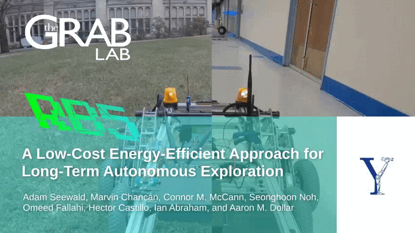

# RB5 wheeled experimental robotic platform ROS2 and ROS packages

In this git repo, you can find the source code of the ROS2 and ROS packages for the RB5 experimental robotic platform. 

It constitutes the supplementary material to the paper "A low-cost energy-efficient approach for long-term autonomous exploration": https://adamseewald.cc/short/rb52023

[](https://youtu.be/Vflmh6LTo6A)

---

## Installation

Install all the ROS2 and ROS packages in your local workspace. Use an external device with a web server as a base station.

In this repository, you can find the **ground robot**: `rb5-ground-robot` ROS2 package, which contains the code that runs on the companion computer onboard RB5, i.e., an <a rel="jetson" href="https://www.seeedstudio.com/reComputer-J2021-p-5438.html?">NVIDIA (R) Jetson NX (TM)</a>.

There is additionally the **ground navigation**: `rb5-ground-nav` ROS package, which contains the code that collects point clouds from an RGB-D camera and other data from the SLAM algorithm and ports them into ROS2 [here](https://github.com/adamseew/rb5-ground-navigation).

Finally, there is also the **base server** PHP- and JavaScript-based remote control base station that implements the necessary functionality for remote human intervention [here](https://github.com/adamseew/rb5-base-server).


## Usage

Clone the repository in your local ROS2 workspace and compile the workspace. Rember to move the directory [`rb5-ground-navigation`](https://github.com/adamseew/rb5-ground-navigation) in a ROS1 workspace and compile accordingly, and to use the directory [`rb5-base-server`](https://github.com/adamseew/rb5-base-server) in a PHP compatible web server, e.g., [Apache](https://httpd.apache.org/).

For instance, to run the remote control via LoRa long-range low-power communication technology from the internet-of-things domain, you will need the `chw_bs_comm` node (communication with a remotely located base station) and the `chw_ctl_comm` node (communication with the microcontroller). From bash, run:
```bash
ros2 run rb5-ground-robot chw_bs_comm
```
and from another instance:
```bash
ros2 run rb5-ground-robot chw_bs_bs
```


## Hardware

Follows a list of the necessary hardware for the approach. Motors, motor drives, and the battery are not listed.

| HW | Scope | Amount |
|-|-|:-:|
| <a rel="jetson" href="https://www.pjrc.com/store/teensy40.html">Teensy (R) 4.0 Development Board</a> | Low level processing, microcontroller | 1x |
| <a rel="jetson" href="https://www.seeedstudio.com/reComputer-J2021-p-5438.html?">NVIDIA (R) Jetson NX (TM)</a> |  High level processing, companion computer onboard | 1x |
| <a rel="lora" href="https://ronoth.com/products/lostik">LoRa bundle with the RN2903 module</a> | Communication on long distances | 2x |
| <a rel="RGB-D" href="https://www.intel.com/content/www/us/en/products/sku/189347"> Intel (R) AX200 network card</a> | Communication on short distances | 1x |
| <a rel="RGB-D" href="https://www.intelrealsense.com/depth-camera-d435/">Intel (R) RealSense (TM) D435 RGB-D camera</a> | Visual sensing, depth perception, SLAM | 1x |


## License
<a rel="license" href="http://creativecommons.org/licenses/by-nc-sa/4.0/"></a><br />This work is licensed under a <a rel="license" href="http://creativecommons.org/licenses/by-nc-sa/4.0/">Creative Commons Attribution-NonCommercial-ShareAlike 4.0 International License</a>.

